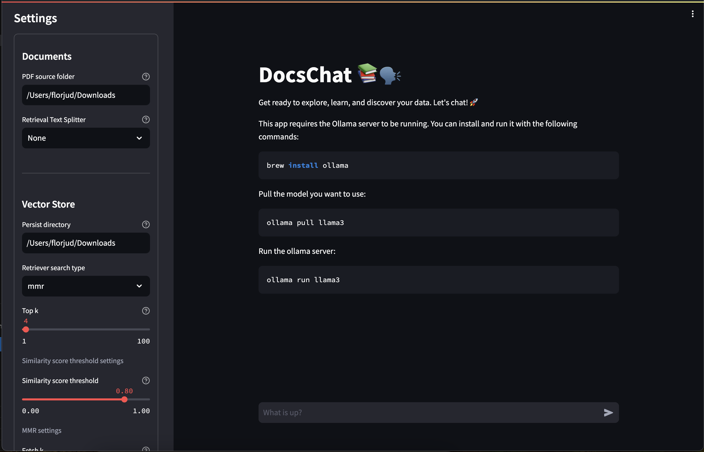
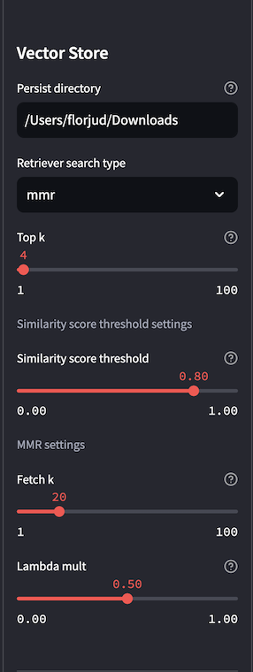
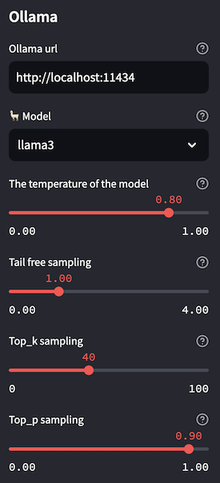
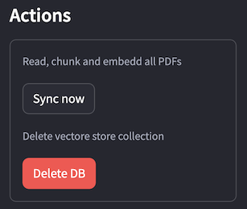

# DocsChat 📚🗣️

`docchat` is a command-line interface that let's you start a local streamlit server and interact with your documents.

The chatbot utilizes a conversational retrieval chain to answer user queries based on the content of embedded documents. It leverages various NLP techniques, including language models and embeddings, to provide relevant responses.

## Features

- **Document Embedding:** Embeds PDF documents for efficient retrieval of information.
- **Conversational Interface:** Allows users to interact with documents through a chat interface.
- **Settings:** Provides customizable settings for configuring document retrieval and model parameters.

## Installation

To run the application locally, follow these steps for installation.

```bash
pip install DocChat
```

Pulll Ollama llm:

```bash
ollama pull llama3
ollama pull llama2
ollama pull gemma
ollama pull mistral
ollama pull codellama
```

Start the Ollama server:

```bash
ollama run llama3
```

Run the application:

```bash
docchat
```

## Configure



### PDF sources

- Configure the PDF source directory from which all PDFs should be read in recusively.
- Select a splitter, this has an influence on the chunks that we will make available to the LLM and thus also on the answers. By default no splitter is selected, this means a larger context.

### Vector store



- Chroma DB in memory is used as a vector store, which stores the data in a Persit directory, so the data in the DB is also available after the restart.
- The Retriever search type has and the various parameters influence the search of documents in the Vectore Store.

### Ollama



- Configure the ollama server connection and the model with which the server was started.
- the LLM parameters influence the embedding of the PDFs but also the answering of questions in the RAG pipeline.

## Actions



There are two functions available, the sync of PDF documents into the Vectore Store. This can take some time depending on the system resources, embedding and splitter. The Delete DB function deletes the Chroma Collection.
